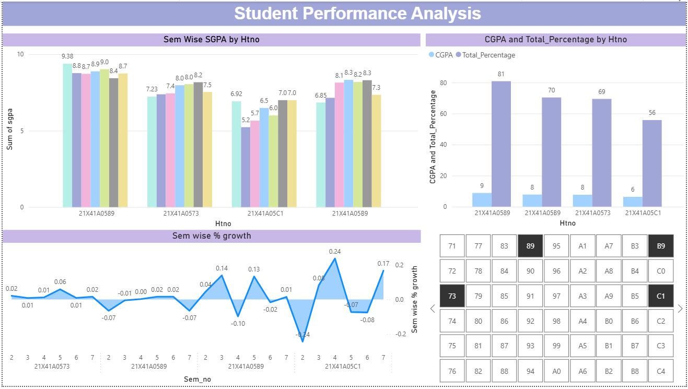
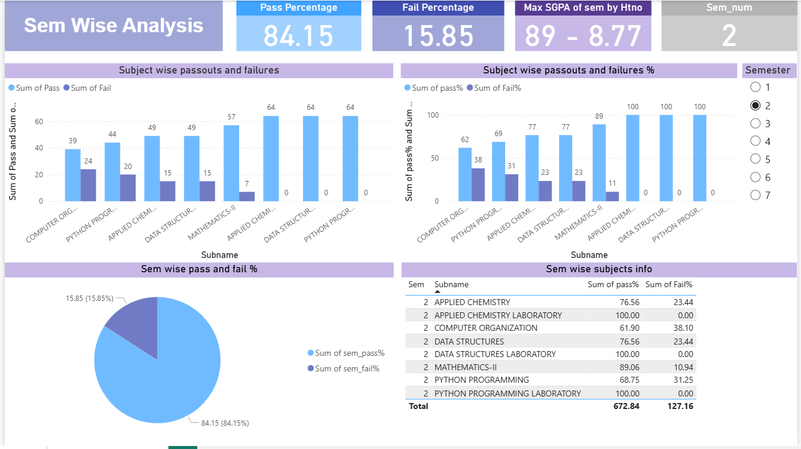

# Semester_Data_Analysis
This Power BI dashboard project is designed to visualize and analyze student performance across semesters. 
It enables faculty, academic coordinators and decision-makers to gain actionable insights into academic trends, subject-wise outcomes and semester-wise results.
## 📊 Features

- 📌 **Slicer**
   -Slicer helps to select multiple hallticket numbers to view only the selected students data       and their performance.
  
- 📌**Semester-wise SGPA**
  - Bar chart showing SGPA of 8 semesters for each student based on selected hallticket number.
    
- 📌 **Overall CGPA and Percentage**
   - Bar chart showing overall Cumulative Grade Point Average and Percentage.
      
- 📌 **Semester-wise percentage growth**
   - Area chart showing the percentage growth by comparing present percenatge with the previous sem percenatge.

- 📌 **Semester-wise Subject Performance**
  - Bar charts showing subject-wise **pass and fail counts**
  - Bar charts showing subject-wise **pass and fail percentages**
  
- 📌 **Semester Summary Overview**
  - Pie chart showing **overall pass vs fail percentage** for each semester

- 📌 **Card Indicators**
  - Selected semester number
  - Pass percenatge of selected sem.
  - Fail percentage of selected sem.
  - Top performer of sem with hallticket number.
  
- 📌 **Dynamic Filtering**
  - Interactive slicer to filter all visuals by **semester number**
  - All charts and KPIs update automatically based on selection
    
## 🛠️ Tools & Technologies
- **Power BI Desktop**
- DAX (Data Analysis Expressions)
- **Excel**

## 📷 Preview

> 

> 

## 📈 Use Case
This dashboard is ideal for:
- Department Heads tracking academic performance
- Faculty analyzing subject-wise trends
- Academic councils for curriculum reviews and support interventions

## 💡 Author
Developed by [Divya Sree Jampani]  
Contact: [divyasreejampani@gmail.com]  
LinkedIn: [www.linkedin.com/in/divya-sree-jampani]
